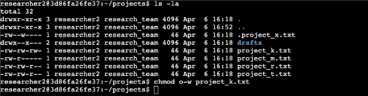
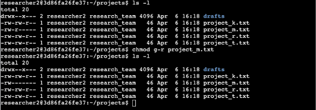
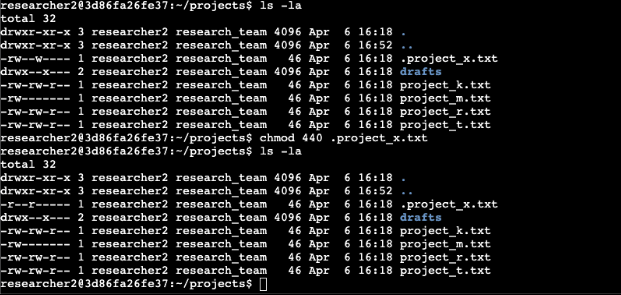
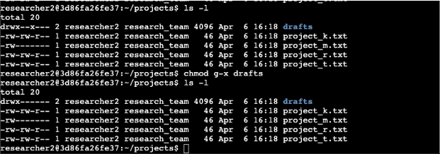

# Linux File Permission Audit & Access Control Enforcement

**From Concrete to Corporate** | [GitHub](https://github.com/Sgt0daycodes) | [LinkedIn](https://linkedin.com/in/YOURHANDLE)

> *The environment changed. The standard didn't.*

---

## Overview

Reviewed and updated file and directory permissions in a Linux environment for a research team at a large organization. The environment presented multiple authorization misconfigurations — files with excessive write access, a hidden file writable by the wrong owners, and a directory accessible to unauthorized groups.

Every permission string was inspected, interpreted, and corrected against the organization's authorization requirements using the principle of least privilege. No access was assumed safe. Every change was verified.

---

## Environment

| | |
|---|---|
| **Platform** | Linux — Command Line Interface |
| **Commands** | `ls -l` · `ls -la` · `chmod` |
| **Scope** | File permissions · Hidden file permissions · Directory permissions |
| **Principle Applied** | Least Privilege |

---

## Goals

1. Inspect current file and directory permissions using `ls -l` and `ls -la`
2. Interpret 10-character permission strings to identify unauthorized access
3. Remove excessive write permissions from files accessible to unauthorized owners
4. Correct hidden file permissions on an archived file that should not be writable
5. Remove unauthorized group execute access from a restricted directory
6. Verify all changes post-modification to confirm enforcement

---

## Steps Executed

### Step 1 — Inspect File and Directory Permissions

**Command:**
```bash
ls -l
ls -la
```

Ran `ls -l` to review visible file permissions and `ls -la` to surface hidden files. The output revealed the full permission landscape of the projects directory.


**Permission strings identified:**

| File | Permission String | Issue |
|---|---|---|
| `drafts/` | `drwx--x---` | Group has execute access — should be owner only |
| `project_k.txt` | `-rw-rw-rw-` | Others have write access — unauthorized |
| `project_m.txt` | `-rw-r-----` | Group has read access — should be owner only |
| `.project_x.txt` | `-rw--w----` | Group has write access — archived file, no one should write |

> **Security Note:** Hidden files — those beginning with a period — are not displayed by `ls -l`. Using `ls -la` is required to surface them during an access control review. Skipping hidden files during an audit leaves a blind spot.

---

### Step 2 — Interpret the Permission String

Every Linux permission string is 10 characters and maps directly to access controls:

```
- rw- r-- ---
│ │   │   └── Others: no permissions
│ │   └──── Group: read only
│ └──────── User: read and write
└────────── File type: - = file, d = directory
```

**Example from this audit:** `-rw-r-----`
- File type: regular file
- User: read + write
- Group: read only
- Others: no access

Reading permission strings accurately is the foundation of access control auditing. Misreading a string means missing an exposure.

---

### Step 3 — Remove Unauthorized Write Access: `project_k.txt`

**Command:**
```bash
chmod o-w project_k.txt
```

`project_k.txt` had permission string `-rw-rw-rw-` — the user, group, and others all had write access. The organization does not permit others to write to files. Write access for others on any file is an immediate misconfiguration.



**Before:** `-rw-rw-rw-`
**After:** `-rw-rw-r--`

> **Security Note:** World-writable files are one of the most common Linux misconfigurations. Any user on the system — authenticated or compromised — can modify a world-writable file. `chmod o-w` surgically removes that vector without touching user or group permissions.

---

### Step 4 — Remove Unauthorized Group Read Access: `project_m.txt`

**Command:**
```bash
chmod g-r project_m.txt
```

`project_m.txt` had permission string `-rw-r-----` — the group had read access even though the file was intended to be restricted to the owner only. Read access means the group could view file contents — a data exposure risk for a restricted file.



**Before:** `-rw-r-----`
**After:** `-rw-------`

> **Security Note:** Read access is not harmless. On a restricted file, unauthorized read access exposes contents to anyone in the assigned group — which may include accounts that have no business accessing that data.

---

### Step 5 — Correct Hidden File Permissions: `.project_x.txt`

**Command:**
```bash
chmod 440 .project_x.txt
```

`.project_x.txt` is an archived hidden file. Its permission string was `-rw--w----` — the user had read and write access, and the group had write-only access. An archived file should not be writable by anyone. Both the user and group should retain read access only.



**Before:** `-rw--w----`
**After:** `-r--r-----`

`chmod 440` translates to: user = read (4), group = read (4), others = none (0).

> **Security Note:** Write access on an archived file means its contents can be modified or overwritten — defeating the purpose of archiving. Hidden files are frequently overlooked in access control reviews. `ls -la` is non-negotiable in any audit.

---

### Step 6 — Remove Unauthorized Group Execute Access: `drafts/`

**Command:**
```bash
chmod g-x drafts
```

The `drafts` directory had permission string `drwx--x---` — the group retained execute access, meaning group members could traverse into the directory even though only `researcher2` should have access. Directory execute permission controls the ability to enter and access contents within.



**Before:** `drwx--x---`
**After:** `drwx------`

> **Security Note:** Execute permission on a directory is not about running files — it controls directory traversal. A user with execute access on a directory can navigate into it and access its contents even without read permission on the directory itself. Removing it locks the directory to the owner only.

---

## Permission Change Decision Log

| File/Directory | Original Permissions | Issue | Command Applied | Result |
|---|---|---|---|---|
| `project_k.txt` | `-rw-rw-rw-` | Others have write access | `chmod o-w project_k.txt` | `-rw-rw-r--` |
| `project_m.txt` | `-rw-r-----` | Group has read access | `chmod g-r project_m.txt` | `-rw-------` |
| `.project_x.txt` | `-rw--w----` | Group has write; user has write on archived file | `chmod 440 .project_x.txt` | `-r--r-----` |
| `drafts/` | `drwx--x---` | Group has execute/traversal access | `chmod g-x drafts` | `drwx------` |

---

## Summary

Used Linux commands to review and enforce proper authorization settings across a research team's file system. Every visible and hidden file was inspected using `ls -l` and `ls -la`. Every permission string was interpreted against the organization's access requirements. Four misconfigurations were identified and corrected using `chmod`. All changes were verified post-modification.

The environment moved from multiple unauthorized access points to a least-privilege state — with every change documented, justified, and confirmed.

---

## Skills Demonstrated

`Linux CLI` `File Permissions` `Access Control` `chmod` `ls -l` `ls -la` `Least Privilege` `Permission String Analysis` `Hidden File Auditing` `Directory Security` `System Hardening`

---

*From Concrete to Corporate — "The environment changed. The standard didn't."*
*[github.com/Sgt0daycodes](https://github.com/Sgt0daycodes)*
